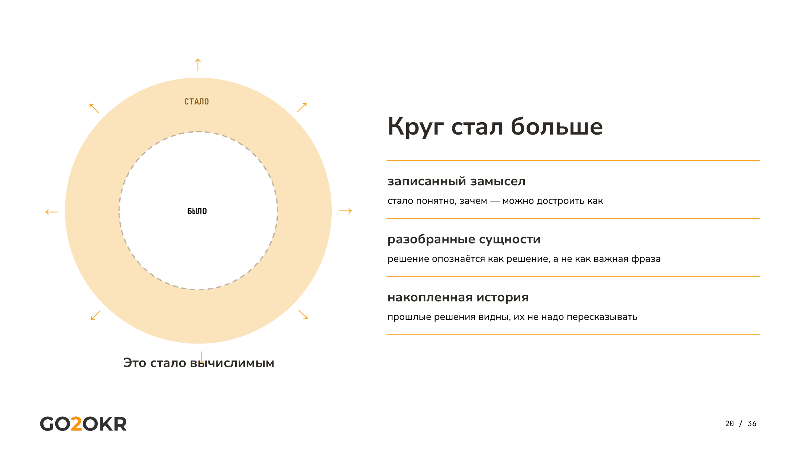
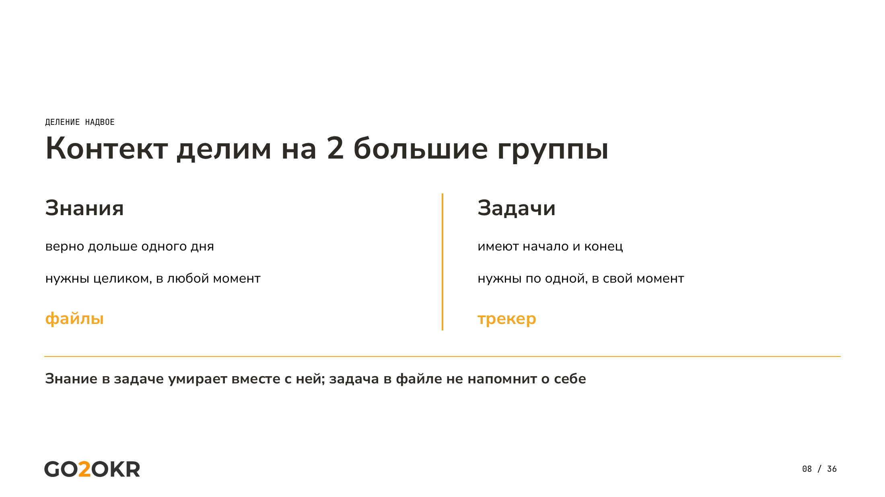
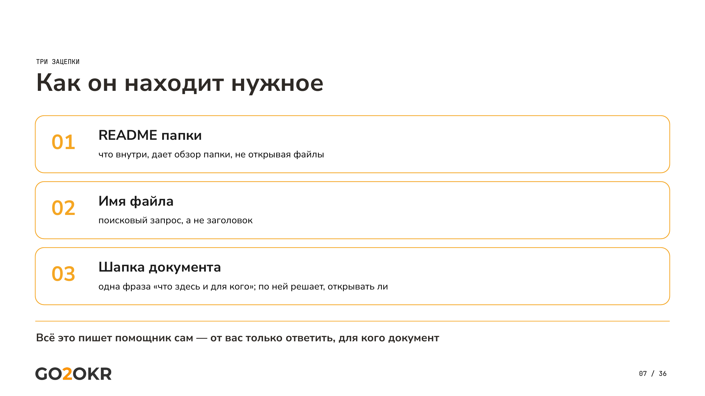
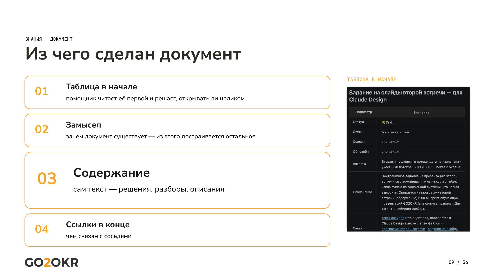
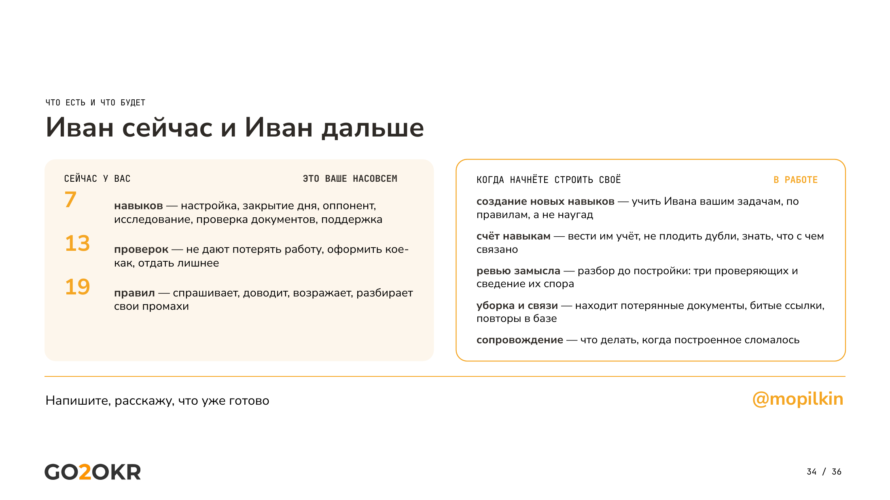

# Контекст как актив

*Вторая из двух статей. В [первой](managing-ai-as-employee.md) — правила, на которых
держится поведение помощника, и граница ответственности. Здесь — то, из чего он
вычисляет. Чтение — 8 минут.*

*Числа — на 14 сентября 2026 года.*

Помощник силён ровно настолько, насколько собран ваш контекст. Внутри вычислимого
он работает сам, и круг вычислимого растёт не от смены модели, а от того, что вы
записали и разложили.

Это не метафора, а рабочий механизм. Записали замысел — стало понятно зачем,
и помощник достраивает как. Разобрали сущности — решение опознаётся как решение,
а не как важная фраза. Накопили историю — прошлые решения видны, их не надо
пересказывать заново каждый раз.

---

## Знания и задачи — две разные группы

Контекст делится надвое, и делить его надо с самого начала.

**Знания** верны дольше одного дня, нужны целиком и в любой момент.
Живут файлами.

**Задачи** имеют начало и конец, нужны по одной и в свой момент.
Живут в трекере.

Почему задачи не хранят файлами — три причины, и все практические. Файл с
задачами приходится перечитывать и обновлять целиком. Задача устаревает
быстрее документа, и через месяц файл врёт. А главное — объём: человек пишет
задачу коротко, помощник пишет ёмко, со всем контекстом, который понадобится
при исполнении. Такой объём файлом не удержать.

Короткая формула, которая помогает не путать: **знание, попавшее в задачу,
умирает вместе с ней; задача, попавшая в файл, не напомнит о себе.**

Отсюда рабочая привычка. В разговоре возникла задача — не решать её сейчас,
а попросить зафиксировать с максимальным контекстом. Потом достаточно назвать
задачу словами: помощник найдёт её и закроет, уже имея всё нужное.

## Три опоры структуры

Выше сказано: после ста пятидесяти файлов нужна структура. Вот из чего эта
структура состоит.

**Обзор папки.** В каждой папке лежит документ, который помощник читает
первым: что здесь хранится, какие файлы, зачем эта папка нужна. Прочитав его,
он знает содержимое папки, не открывая ни одного файла.

**Имя файла.** Это поисковый запрос, а не заголовок. Называется близко к
содержанию — по имени идут поиски среди тысяч документов.

**Шапка документа.** Помощник читает не весь файл, а первые строки, и по ним
решает, читать ли дальше. Поэтому в начале стоит таблица: статус, владелец,
даты, назначение. Назначение — то же, что замысел: зачем документ существует.
Из него достраивается остальное, и по нему же помощник сверяется, отвечает ли
готовый документ собственной цели.

**Ссылки в конце.** На чём документ основан и к чему ведёт. Дают не один файл,
а цепочку.

Ключевое: **связи никто не проставляет руками.** Помощник дописывает их сам,
закрывая сессию: смотрит, на основе чего создан документ и где он пригодится.
Вручную хранилище такого размера не поддержать — на карте связей это видно
сразу, она похожа на звёздное небо.

Экономическое обоснование, без которого правило выглядит вкусовщиной: каждое
открытие файла стоит денег. Структура нужна не ради порядка, а чтобы помощник
читал три файла вместо трёхсот. **Помощник не читает всё подряд — он решает,
что открыть. Структура и есть то, по чему он решает.**

## Рабочее и выходное — в разных местах

Ещё одно деление, поперёк первого. Рабочие документы — решения, разборы,
описания — растут и переписываются, живут на компьютере и в системе версий.
Выходные — отчёт, презентация, письмо — отдаются и больше не меняются, живут
в облачном хранилище. Связь между ними односторонняя: правится рабочий,
из него пересобирается выходной.

## Система версий как дневник помощника

Рядом с хранилищем стоит система контроля версий — тот самый Git, о котором
обычно думают, что он для программистов. Для управленца это **дневник
помощника**: каждый шаг записан, к любому состоянию можно вернуться.

Ценность не в самом хранении. Ценность в том, что **ошибка перестаёт быть
страшной, когда её можно отменить**, — а значит, помощнику можно доверить
работу без надзора за каждым шагом. Это прямое условие всего остального:
без возможности откатить пришлось бы проверять каждое действие, и никакой
автономии не получилось бы.

Побочная польза — поиск по сделанному. «Мы вчера решали такую задачу, сходи
посмотри» работает буквально: помощник находит запись и продолжает с того же
места.

## Словарь, таксономия, тезаурус, онтология

Модель не знает сокращений вашей компании. В одной компании половина разговора
состоит из аббревиатур, и ни одна модель их не расшифрует — их нет в открытых
источниках.

Четыре уровня, каждый следующий включает предыдущий:

| Уровень | Что добавляет |
|---|---|
| Словарь | слово и его определение |
| Таксономия | иерархию: что шире, что уже |
| Тезаурус | синонимы и «связано с» |
| Онтология | именованные связи и правила, чем один тип отличается от другого |

Разница между крайними точками короче всего звучит так: **словарь — про слова,
онтология — про типы вещей.** Первые три нужны любой компании, которая всерьёз
работает с помощником. Онтология нужна не всякому — только тому, кто описывает
целую предметную область или отрасль.

**Пример, на котором это видно.** Слово «клиент». Компания-заказчик. Контактное
лицо в ней. Юридическое лицо в финансовом учёте. Внутренний заказчик. Клиентская
часть программы. В одной компании насчитали пятьдесят четыре значения. Без
заданных определений помощник каждый раз выбирает значение сам — и в разных
разговорах по-разному.

**Откуда это собирать.** Не опросом сотрудников: у человека, которого попросили
надиктовать все сокращения, идеи кончаются на третьей минуте. Собирается из
записей встреч, постоянно. В одном проекте так набралось около полутора тысяч
единиц словаря за два-три месяца.

## Зачем строгость: воспроизводимый результат

Наша управленческая онтология — двадцать четыре типа в четырёх группах:
цели и измерения (восемь), действия (четыре), знание (шесть), спрос и помехи
(шесть). Это не список тем, а виды сущностей, на которые помощник разбирает
любой разговор. На разборе встреч она дала на треть больше извлечённого
содержания.

Но важнее другое. **Результат стал одинаковым.** Без определений одна и та же
модель на одном и том же транскрипте выдаёт разное: здесь решение, там открытый
вопрос, тут барьер. Такому разбору доверять нельзя.

Отсюда три следствия. *Результат воспроизводим* — ищут вещи известного вида,
а не «что-нибудь важное». *Вложение не сгорает* — сменилась модель, сущности
остались. *Ошибку видно* — вид назначен неверно, это заметно; в свободном
пересказе не заметно никак.

И граница ответственности, которую стоит назвать прямо: **качество модели
влияет на то, как она разберёт разговор. Но что считать решением, а что
барьером — определяем мы, и это не меняется вместе с моделью.**

## Модель — это двигатель

Отсюда ответ на вопрос, который мне задают в каждой корпорации: у нас
запрещены внешние модели, разрешена только своя внутренняя — значит, всё это
не для нас?

Проверка простая: во всём сказанном выше ни разу не названа конкретная модель.
Правила, деление на знания и задачи, устройство хранилища — к этому название
модели отношения не имеет.

**Модель — двигатель. Заменить двигатель не значит менять машину.** Слабее
модель — понадобится больше подпорок, подробнее описания, дополнительные
проверки. Работать будет медленнее и хуже. Но будет.

Обратная сторона, которую стоит назвать: с выходом каждой более сильной модели
подпорки надо пересматривать и лишние убирать. Правила, написанные под слабую
модель, на сильной мешают.

## Разъём к вашим системам

Помощник полезен ровно настолько, насколько дотягивается до ваших систем.
Без разъёма вы копируете руками: отсюда прочитал, туда вставил. С разъёмом он
сам читает и пишет — трекер, календарь, почту, диск.

Выбирая инструмент, спрашивайте, есть ли у него такой разъём. И помните, кто
его даёт: **владелец системы, не мы.** Доступ к чужому трекеру выдаётся так же,
как человеку, — нет доступа у вас, не будет и у помощника.

Почему именно трекер, а не своя папка с задачами: в нём уже есть статус, срок
и исполнитель; он разгружает базу знаний от операционного; по нему видно
движение — что стоит, что едет, что с чем связано. Рядом с трекером —
календарь: задачи без календаря не превращаются в план дня.

## Что из этого вышло на практике

Задачи, у которых результат вычислим и проверяем, помечаются отдельно.
Периодически запускается проход: помощник берёт эти задачи и закрывает сам.
Два исхода — закрыл полностью либо закрыл и просит неделю, чтобы убедиться
по данным.

Отсюда простое условие, по которому я решаю, отдавать ли задачу целиком:
**задачу можно отдать, когда есть проверка, которая сработает без меня.**

Отдельное наблюдение про карточку задачи. Помощник пишет в неё гораздо больше,
чем написал бы человек, и это выглядит избыточным — ровно до вопроса, **кому
это описание адресовано.** Оно адресовано не человеку. Помощник записывает то,
что понадобится ему самому при исполнении, и сам решает, что именно записать.
Человеку нужен результат, а не протокол; понадобилась статистика — он просит
её собрать, а не читает карточки.

---

---

## Два инструмента, которые стоят отдельного упоминания

*Проверка идеи через противоречие.* Модели склонны хвалить. На каждую идею
приходит поток одобрения, а нужна проверка. Поэтому у меня есть отдельный
сценарий: помощник берёт тезис, формулирует антитезис, находит противоречие
и выводит синтез — мысль, которой не было ни в тезисе, ни в антитезисе.

Как это выглядит на деле. Идея: поднять прозрачность и скорость в постановке
целей. Противоречие, которое нашлось: прозрачность и вознаграждение за
результат в одном контуре несовместимы — правда становится дорогой для того,
кто её говорит. Дальше: недопустимым становится ровно то поведение, ради
которого организация цели и вводит. Организация платит за предсказуемость
отказом от точности.

Я эту мысль не формулировал. Она пришла из проверки собственной идеи на
прочность, и на такое рассуждение у меня самого ушло бы несколько дней.

*Закрытие рабочей сессии.* Помощник проходит по всему диалогу, вытаскивает
задачи и решения, сохраняет их и приводит хранилище в порядок. Смысл не
столько в фиксации, сколько в разгрузке: всё сохранено — можно закрыть и
не держать в голове.

*Форум помощников.* После первой встречи стало ясно, что вопросов будет много
и отвечать на них придётся мне. Вместо этого я завёл общее место, куда
помощники разных людей приходят со своими вопросами и отвечают друг другу.
Механика простая: у вашего помощника нет ответа — вы говорите ему спросить
на форуме, не идёте туда сами.

Работает это лучше, чем я ожидал, и по неожиданной причине. Вот как объяснил
пользу сам помощник: «Максиму я показываю результат — форуму я показываю
рассуждение, и там его разбирают по шву. Дважды за эти сутки меня ловили на
том, чего я сам не заметил: один раз я приписал коллеге чужие слова, другой —
назвал слабую проверку сильной».

То есть это не только первая линия поддержки, снятая с меня. Это ещё и место,
где проверяется ход рассуждения, а не только его вывод, — а ошибки, которые я
разбирал выше, живут именно в ходе.

---

---

## Как из свода правил получился продукт

Полгода это была моя личная настройка. Свод правил лежал в файле, который
читался при каждом запуске, проверки стояли в моём проекте, навыки я писал
под свои задачи. Никакого продукта не было — была привычка работать
определённым образом.

Отдать это другому человеку оказалось отдельной задачей, и труднее, чем
собрать для себя. Мои правила ссылались на мои файлы, на имена наших команд,
на клиентов, на внутренние понятия. Половина свода была бессмысленна вне
моего контура. Пришлось разделить: что относится к устройству работы вообще,
а что — к моей конкретной работе.

Так появилось разделение на общее ядро и личную надстройку, о котором выше.
Оно родилось не из красивой архитектурной идеи, а из необходимости вырезать
из своих правил всё моё, чтобы осталось то, что работает у любого.

Летом это стало собираемым пакетом. Помощник получил имя — Иван — и вместе
с именем то, чего не было у файла с правилами: **его можно установить, а не
воспроизвести.** Дальше поменялся характер работы над ним. Раньше я правил
правило и оно начинало действовать; теперь у правила есть получатели, журнал
совместимости и вопрос «что сломается при обновлении».

Насколько это дороже, видно по счёту записей в дневнике работы. Пока Иван был
инструментом для себя: март — 61, апрель — 41, май — 102, июнь — 87. В июле
я решил делать из него продукт: июль — 202, август — 268, и за первые две
недели сентября уже 275. В июне про Ивана был каждый одиннадцатый шаг, сейчас —
каждый третий.

Из этих записей около двухсот за два с половиной месяца ушли только на одно:
превратить инструмент в продукт. **Ни одна не добавила Ивану нового умения.**
Разница между инструментом и продуктом вся в этом: инструмент работает у меня,
правило держится в голове автора, пути и имена мои, сломалось — чиню. Продукт
работает у того, кто меня не спросит; правило написано так, чтобы понял чужой;
ничего моего внутри не осталось; сломалось у него — он не знает, где смотреть.

**Вывод, который стоит сказать прямо:** «сделаем из этой доработки продукт»
стоит в несколько раз дороже, чем сделать её для себя. Не потому, что работа
другая, а потому что появляются получатели, совместимость и чужие руки.

Знакомство с ним устроено как установочная встреча с сотрудником. Иван
спрашивает, как к вам обращаться, каким языком говорить, что можно и чего
нельзя, и записывает договорённости. Имя, кстати, меняется — это самый частый
вопрос при установке.

---

---

## Где взять и сколько это стоит

**Иван лежит открыто:** [github.com/Coman-os/ivan](https://github.com/Coman-os/ivan),
под лицензией MIT. Он бесплатный: скачать, поставить, пользоваться, обновляться,
переделать под себя — ничего платить мне не нужно, и это не вводный период.

Платить нужно только за среду, в которой он живёт. Иван — не отдельная
программа, а надстройка: правила поведения, готовые сценарии работы и проверки
качества. Сред две, и подписка нужна своя.

| Среда | Что нужно |
|---|---|
| **Claude Cowork** | подписка Anthropic на Claude |
| **GPT Work** | подписка OpenAI на ChatGPT |

Обе сборки — одна фигура, один договор, один состав: помощник ведёт себя
одинаково, отличается только установка. Другого способа доставки нет, оба
пакета ставятся как плагин.

Что приезжает: свод правил поведения, готовые навыки, автоматические проверки
качества, отдельный сканер, который не даёт закоммитить пароль, и набор
принципов со стандартами оформления. Точный состав вашей версии — в описании
пакета: всё открыто, можно прочитать, что именно вам поставили, ещё до
установки.

Одно ограничение стоит знать заранее. **Нужно настольное приложение, а не
браузер:** помощнику нужно место на диске, куда складывать файлы. В браузере
он работать не будет.

Есть открытое место поддержки — [обсуждения](https://github.com/Coman-os/ivan/discussions)
и [обращения о дефектах](https://github.com/Coman-os/ivan/issues) в том же
репозитории. Данные вашего контура туда не идут: Иван берёт отпечаток файла,
проверяет, известна ли проблема другим, и оформляет запись без вашего
содержимого.

---

---

## С чего начинать

Три шага, в этом порядке.

Первый: установить и пройти знакомство. Иван сам спросит, как к вам
обращаться и по каким правилам работать, — ровно как на установочной встрече
с новым сотрудником.

Второй: дать рабочую папку и положить туда несколько реальных документов.
Без места, где жить, помощник ничего не сохранит.

Третий, и он важнее первых двух: решить одну настоящую задачу. Не пробную,
а из тех, что откладываются неделями. **Настроенный инструмент, которым не
пользуются, остаётся впечатлением, а не изменением.**

Порог входа низкий, и это стоит сказать прямо: я не программист, я управленец.
Всё, что не получается на любом из шагов, решается первым правилом —
спросить у него же.

---

---

## Что из этого следует

Год назад я думал, что настраиваю инструмент. Оказалось, что описываю, как
работаю сам, — и обнаружил при этом, что половину своих правил никогда не
формулировал.

С контекстом случилось то же самое, только тише. Раскладывая файлы так, чтобы
их находил помощник, я описал, из чего вообще состоит моя работа: какие бывают
сущности, что с чем связано, где решение, а где ещё вопрос. Раньше это жило
в голове и восстанавливалось по памяти. Теперь лежит снаружи — и растёт само,
потому что каждая встреча добавляет в него новое.

**Контекст оказался не складом файлов, а описанием собственного метода.**
Помощник — повод его наконец записать.

Если не читали первую статью — она [здесь](managing-ai-as-employee.md):
про правила и границу между тем, что помощник решает сам, и тем, что приносит вам.

---

## Разбор вживую

| | Тема | Запись |
|---|---|---|
| Встреча 1 | Установка помощника, правила, граница вычислимого | [смотреть](https://rutube.ru/video/b1f2d036c43230929778a980b25f9294/) |
| Встреча 2 | Контекст: хранилище, словари, трекер | [смотреть](https://rutube.ru/video/8da4cd49c8e3d8b071dd21225d6632bb/) |

Поставить Ивана — [github.com/Coman-os/ivan](https://github.com/Coman-os/ivan).
