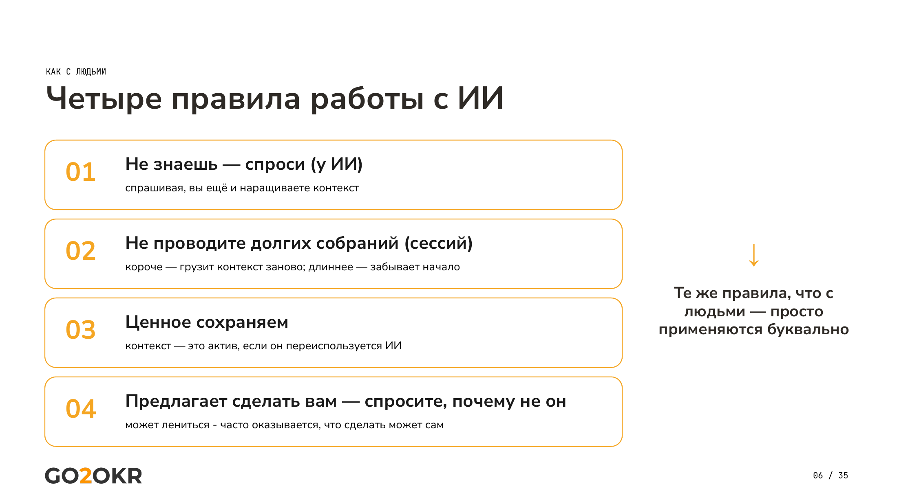
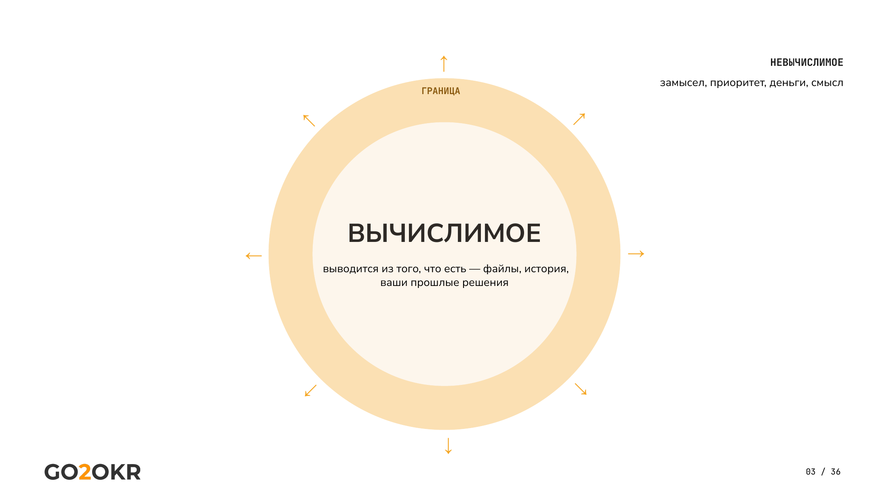
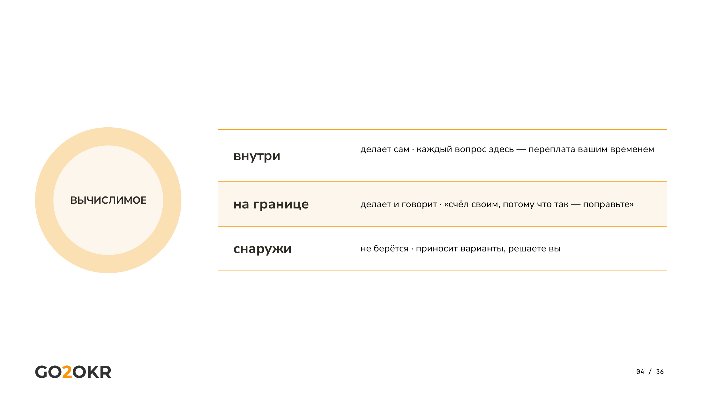
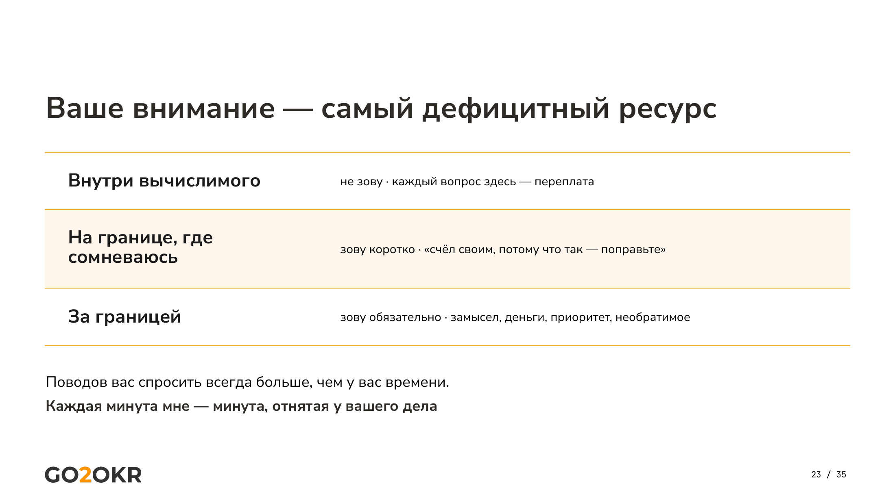
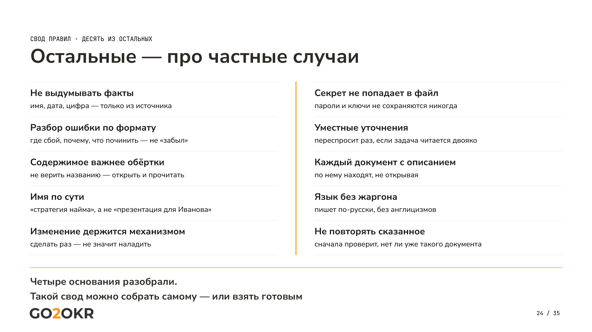
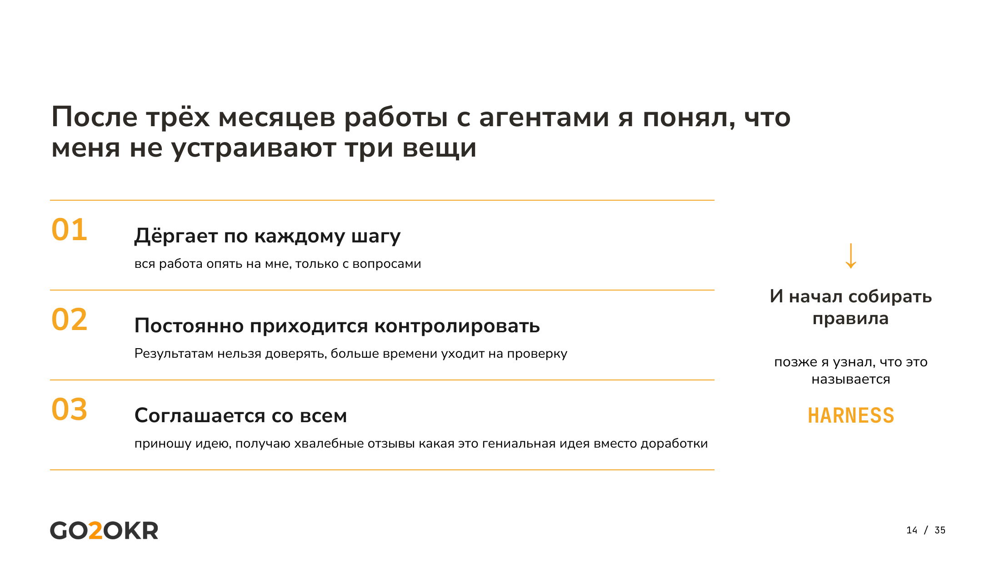

# Управлять искусственным интеллектом как сотрудником

*Первая из двух статей. Здесь — правила, на которых всё держится, и граница
ответственности между человеком и помощником. Вторая — про контекст, из которого
помощник берёт силу. Чтение — 10 минут.*

*Числа — на 14 сентября 2026 года.*

Год назад я начал работать с искусственным интеллектом так же, как большинство:
задал вопрос, получил ответ, закрыл окно. Сегодня у меня помощник, который держит
**около четырёх с половиной тысяч документов** и тысячу двести задач. Он сам их
раскладывает и находит нужное. **Семнадцать процентов задач он закрывает без
моего участия** — это нижняя оценка, считалось только по тем, где результат
заранее размечен как проверяемый.

Путь был из трёх ступеней. Сначала агенты для целей — помогали формулировать
и структурировать. Потом операционная работа — стали брать рутину на себя.
Теперь со-управление: **часть контура управления держит машина, часть — человек.**

Разница между началом и сегодняшним днём — не в том, что модели стали умнее.
Они стали, но дело не в этом. Разница в том, что **я перестал обращаться с
искусственным интеллектом как с умным чатом и начал управлять им как
сотрудником.**

Разница примерно как между «спросил у случайного эксперта в лифте» и «нанял
человека, который помнит все прошлые разговоры». Эксперт в лифте может быть
умнее нанятого. Пользы от нанятого больше.

---

## Четыре правила

### Не знаешь — спроси. У него же

Самое частое правило и потому первое. Не знаете, как что-то сделать, —
не ищите ответ на стороне и не думайте сами. Спросите у помощника.

Пример, на котором это лучше всего видно. Постоянный вопрос: пора ли начинать
новую сессию или продолжать текущую? Логика подсказывает искать критерий —
совпадает ли предмет, нужен ли прежний контекст. Я честно искал этот критерий
несколько недель. Правильный ответ оказался короче любого критерия:
спросите об этом самого помощника. Он знает, сколько контекста накопилось,
что из него стоит перенести и как сформулировать начало новой сессии.

То же со всем остальным. Не ставится, не хватает прав, не подключается папка —
опишите проблему словами и получите инструкцию. Правило выглядит банальным
ровно до того момента, пока не начинаешь его применять. Тогда выясняется,
что половина времени, которое тратилось на поиск обходных путей, была лишней.

У правила есть граница, и её надо назвать сразу, иначе оно опасно.
**Ответ модели — не источник.** Различие такое: вопрос о работе — как сделать,
где искать, почему не получается — задаётся помощнику, и на этом всё. Вопрос
о факте — сколько, когда, кто именно сказал — задаётся помощнику за адресом
источника, а дальше вы идёте к источнику. И проверяете сам источник, а не его
пересказ. Цифра из пересказа отчёта не есть цифра из отчёта. «В выгрузке нет
такого поля» не означает, что поля не существует.

### Ставьте задачу через замысел, а не через способ

Два способа поставить одну задачу:

«Сделай презентацию на два слайда, на первом такое-то, на втором такое-то».

«Мне нужно убедить совет директоров выделить деньги на найм».

Первое — указание способа. Второе — передача замысла.

Раньше объяснять способ имело смысл. Сейчас — чаще вредит: модель найдёт путь,
о котором вы не подумали, а навязанный способ этот путь закроет. Объясняя,
как делать, вы ограничиваете сильнее, чем помогаете.

Отсюда правило, которое я заложил в помощника. Замысел не назван и не найден
в контексте — сначала уточни, зачем это делается, и только потом решай.
Домысленный замысел означает **уверенно сделанную не ту работу**, и это худший
из возможных исходов: результат выглядит готовым.

**Вопрос «зачем» важнее вопроса «как».** «Как» почти всегда вычисляется
из «зачем». Обратное неверно.

### Контекст — это актив

**Контекст становится активом не тогда, когда он накоплен, а тогда, когда он
подготовлен к переиспользованию:** сохранён, описан, разложен.

Есть порог, за которым это перестаёт получаться само. Примерно после ста
пятидесяти файлов человек уже не помнит, что где лежит. Число совпадает с
известной оценкой круга знакомств, которых человек ещё как-то удерживает
в голове, — и совпадение, кажется, не случайное. Дальше нужна структура,
иначе контекст превращается в свалку, из которой ничего не достать.

Отсюда же смежное правило: содержимое важнее обёртки. Не доверять названию
файла, открыть и прочитать. Хуже всего, когда вывод о содержимом делается из
имени, — тогда ошибка не видна никому.

Это правило самое ёмкое из четырёх, и одной главы ему мало. Устройству
контекста посвящена [вторая статья](context-as-asset.md) целиком.

### Граница: что он решает сам, а что приносит вам

Всё делится на вычислимое и невычислимое.

**Вычислимое** — то, что выводится из того, чем помощник владеет: файлы,
история, ваши прошлые договорённости, понятный результат и способ проверить,
что он достигнут. Здесь он решает сам. Если приходит к человеку внутри зоны
вычислимого, это его ошибка, и она разбирается наравне с любой другой.

**Невычислимое** — то, что требует знания, которого у него нет: ваши замыслы,
интересы, вера — если они нигде не зафиксированы. Здесь он не решает никогда.
Три вещи из этого класса стоит назвать отдельно:

*Замысел.* Чего мы вообще хотим. Часто человек и сам его не сформулировал —
и тогда работа начинается с формулирования, а не с исполнения.

*Воля.* Выбор при высокой неопределённости, когда данных недостаточно и
решение является ставкой. Это не расчёт, и посчитать его нельзя.

*Ответственность.* За последствия отвечает человек. Поэтому граница
необратимого проходит через него, независимо от того, вычислимо решение
или нет.

**Помощник приходит только на границе:** когда не хватает замысла, когда велик
риск, когда действие необратимо. Всё остальное — молча и до результата.

Разложить это можно на три уровня, и я держу их именно в таком виде.
Внутри вычислимого — **не зову, каждый вопрос здесь есть переплата.**
На границе, где сомневаюсь — зову коротко, формулой «счёл своим, потому что
так, поправьте». За границей — зову обязательно: замысел, деньги, приоритет,
необратимое.

Основание простое: поводов спросить руководителя всегда больше, чем у него
времени. **Каждая минута, потраченная на меня, — минута, отнятая у вашего дела.**

Это правило далось дороже прочих, и я пробовал провести границу иначе.
Первая попытка — по типу действия: коммит делай сам, отправку наружу
предлагай. Не сработало: тип действия оказался признаком, а не основанием,
и правило промахивалось каждый раз, когда безобидное по типу действие вело
к необратимому следствию. Пока граница не была проведена по проверяемости
результата, помощник либо дёргал по мелочам, либо брал на себя то, что
следовало вынести наверх.

---

---

## Что ещё оказалось нужным

Четыре правила выше — основание. На момент встречи их было тридцать пять, и копились они
не разом: семь в феврале, восемь к апрелю, двадцать два к июню, тридцать два
к августу. Сейчас сорок четыре — свод продолжает расти, и это нормальное
состояние, а не признак недоделанности.

Начались они с раздражения. После трёх месяцев работы с агентами меня не
устраивали три вещи. **Дёргает по каждому шагу** — вся работа опять на мне,
только теперь ещё и с вопросами. **Приходится всё контролировать** — результатам
нельзя доверять, на проверку уходит больше времени, чем на работу. **Соглашается
со всем** — приношу идею и получаю похвалу вместо доработки. Правила — это ответ
на эти три претензии, а не теоретическая конструкция.

Каждое правило появилось после того, как обнаружился промах. Это важная деталь:
**свод правил нельзя написать заранее, он вырастает из ошибок.**

Несколько правил, оказавшихся полезнее прочих.

*Бритва Оккама.* Каждая сущность обязана оправдать существование. Каждый
раздел документа должен иметь читателя. Из восьми разделов, которые я расписал
для одного документа, у пяти читателей не нашлось. Осталось три. Лишнее стоит
не только внимания, но и денег — в больших системах обработка избыточного
текста обходится в десятки и сотни тысяч рублей.

*Слова — это код.* В управлении людьми многое читается между строк и
достраивается из контекста. С искусственным интеллектом так не выходит:
текст должен иметь одно прочтение.

Пример, который меня убедил. Договорённость «не переманивать топ-менеджеров»
читается двояко: либо запрет распространяется на всех сотрудников, а топы
названы как частный случай, либо переманивать можно всех, кроме топов.
Человек догадается по обстоятельствам. Машина потребует уточнить — и будет
права, потому что двусмысленность была изначально, просто её никто не заметил.

*Самоприменимость.* Правило, которое мы вводим, должно применяться и к нам
самим. Иначе это не правило. Практическое следствие: написав документ,
помощник проверяет его на соответствие собственным принципам и, если не
сходится, говорит и правит. Житейский аналог — «начни с себя»: хочется,
чтобы изменились все вокруг, а мы остались прежними.

*Формат разбора ошибок.* Не «есть проблема», а три пункта: где сбой,
почему возник, что именно починить. Объяснения вроде «забыл» или «не подумал»
запрещены — они ничего не дают ни человеку, ни машине. И если причина
вычислима, помощник не докладывает о ней, а исправляет сам.

*Изменения держатся механизмом.* Сделал один раз — не значит наладил.
Нужен механизм, поддерживающий поведение дальше. Проверено дорого: одно
правило у меня месяц стояло снятым по собственной пометке «до выяснения»,
которую я же и поставил. Работало всё это время не правило, а память о нём —
до момента, когда память кончилась.

*Не выдумывать факты.* Отдельное правило, потому что помощник по природе
склонен достраивать недостающее — и делает это убедительно.

*Секреты не попадают в файлы.* Ключи, пароли, токены не сохраняются и не
уходят наружу. Человек об этом каждый раз помнить не может, поэтому следит
помощник.

*Русский язык без англицизмов.* Появилось из практики: мне сказали, что
половина текста в моих документах на английском. Мне было привычно, коллегам
неудобно.

*Не повторять сказанное.* Прежде чем писать, проверить, есть ли уже такой
документ, и дописать только недостающее.

Здесь возникает вопрос, который мне задают почти всегда. Выше сказано:
не объясняйте помощнику, как решать задачу. И тут же — тридцать пять правил
о том, как ему работать. Противоречие?

Нет, но границу надо обозначить явно, потому что сама она не видна:
**мы не задаём маршрут конкретной задачи, но задаём правила безопасности,
качества и границы полномочий.** Способ решения остаётся за помощником.
Рамки поведения — за нами. Без этого различения свобода помощника выглядит
как свобода строго по утверждённому регламенту.

Поверх правил стоят автоматические проверки. Правило говорит, как надо;
проверка не даёт сделать иначе. Документ без описания физически не сохранится —
и помощник допишет описание, а не найдёт способ обойти запрет.

В обычной компании качество держится на четырёх слоях: принципы, стандарты,
регламенты, контроль. У агента те же четыре, но последний работает иначе.
**Контроль всегда опаздывает. Проверка — нет.** Поэтому агент соблюдает правила
лучше человека: у человека нарушение обнаруживают потом, у агента оно просто
не проходит.

Но проверить можно не всё. На момент встречи из тридцати пяти правил проверками
было покрыто пять. Сейчас проверок больше тридцати, но и правил больше.
Доля непроверяемых остаётся высокой по природе, а не по недоделанности.
«Документ без описания не сохранится» проверка видит. «Возражай, когда видишь
проблему» — не видит, это держится на доверии, как у людей. Отсюда следствие:
**в непроверяемых правилах особенно важны формулировки** — они и есть весь
механизм. А там, где проверка есть, работает то же, что с людьми, только вместо
кнута и пряника — **хук и правило**. Хук не даёт сделать неправильно.
Правило объясняет почему.

---

---

## Откуда взялось имя

Есть старая притча про двух работников. Барин послал Ивана узнать, что за
воз приехал на базар. Иван вернулся и рассказал: воз с сеном, сено такое-то,
из такой-то деревни, укос свежий, продают по такой цене, я сторговался
и привёз. Барин послал с тем же вопросом Петра. Петр вернулся: «Воз с сеном».
— «А чьё сено?» Побежал, узнал, вернулся. — «А сколько просят?» Побежал
снова. Оба старались. Иван стоил пять рублей, Петр — пять копеек.

Разница не в уме и не в усердии. Петр старательный, он много бегал.
Но старательность в форме «жду следующего указания» перекладывает мышление
обратно на того, кто спрашивает.

Я скинул эту притчу своему помощнику — просто как текст, без задания.
И получил ответ, которого не ожидал: он разобрал на ней собственное поведение
в том разговоре. Пересчитал, сколько раз за час прибежал ко мне с вопросом
вместо того, чтобы решить и принести результат. Нашёл, что я двумя репликами
раньше уже сказал ему об этом. Признал, что часть вопросов была законной —
там, где нужно было моё знание, которого у него нет, — а остальное можно было
свести в один заход. И спросил: «Прав я в том, что ты показываешь?»

Тогда я решил, что рядом должен быть Иван, а не Петр. Имя осталось.
И вместе с именем — критерий, который оказался важнее любого правила:
**помощник ценен не тем, что исполняет, а тем, что доводит до результата
и приходит один раз.**

---

## Что забирает машина, а что остаётся человеку

Разделим работу на регулярную деятельность и изменения.

Регулярную помощник забирает целиком. Операции повторяются, описываются
однозначно, цена ошибки невелика, ошибка исправима.

В изменениях он забирает ту часть, где всё понятно: сбор данных, подготовку,
структурирование, порождение вариантов. Человеку остаётся работа в
неопределённости — там, где нужно решить, а не посчитать.

Здесь скрыта ловушка, в которую попадают компании с описанными процессами.
Соблазн — добавить искусственный интеллект в существующий процесс, не трогая
сам процесс. Но с ним процесс может выглядеть совершенно иначе, и основная
выгода именно в этом, а не в ускорении прежнего порядка. **Ускорив плохой
процесс, вы получите плохой процесс, работающий быстрее.** Это как поставить
мощный двигатель на телегу: телега не станет автомобилем, она развалится
на первой сотне.

И одно замечание, которое противоречит расхожему мнению. Считается, что
помощник снижает нагрузку на руководителя, освобождая время на стратегию.
По моему опыту — нет, она растёт. Причина простая, и она не про инструмент.

**Раньше, занимаясь рутиной, можно было отдыхать.** Разбор папки, сведение
таблицы, вычитка документа — работа, которая занимает руки и почти не занимает
голову. Это были естественные перерывы, встроенные в рабочий день. Помощник
забирает именно их, потому что забирает вычислимое, а вычислимое и есть та
часть работы, где думать не надо.

Остаётся новое, неописанное и требующее решения. Каждая задача, дошедшая до
вас, требует внимания по определению — иначе она не дошла бы. Перерывов
между ними нет.

Второе слагаемое — скорость. Когда исполнение перестаёт быть узким местом,
узким местом становитесь вы. Я иногда работаю в трёх-четырёх разговорах
одновременно, и за два часа выгораю полностью — не от сложности, а от
плотности решений на единицу времени.

Меняется не объём нагрузки, а её состав: меньше исполнения, больше выбора.
И это не аргумент против — это то, к чему стоит быть готовым, иначе
освободившееся время уйдёт не на стратегию, а на выгорание.

---

---

## Один помощник на компанию или у каждого свой

Вопрос выглядит техническим, а он организационный, и ответ на него определяет
больше, чем кажется.

Если каждый соберёт помощника под себя, они будут работать по разным правилам.
Через полгода договориться между собой этим помощникам станет труднее, чем
сейчас договариваются люди. У людей есть общая культура, а у них не будет
ничего.

Решение — общее ядро и личные настройки поверх. Ядро — принципы управления,
единые для компании. Личное — стиль общения, дополнительные навыки, свои
правила, не противоречащие ядру. Один руководитель разрешает своему помощнику
неформальный тон, другой требует строго профессионального — это законные
различия, ядро от них не страдает.

Человеку менять поведение под каждого руководителя тяжело. Помощнику —
естественно.

И отсюда следствие, которое я считаю главным во всём тексте.
**Переписывая ядро, можно осознанно двигать компанию.** Правила меняются в
одном месте — поведение меняется у всех сразу. Это инструмент организационного
развития, а не автоматизации. И работает он быстрее любого регламента:
регламент нужно прочитать и захотеть выполнять, а правило в ядре
исполняется по факту.

Где здесь граница безопасного, если речь о корпоративном контуре и общем
ядре на компанию, я пока не знаю. Вопрос не риторический: у меня нет ответа,
и это отдельная большая тема.

Есть и побочный эффект, на который я не рассчитывал. Правила, написанные
для помощника, работают и с людьми. Взаимодействие с машиной — безопасная
среда: ошибка там прощается легче, чем в разговоре с человеком. Привычка
формулировать замысел, не размазывать задачу и требовать разбора причины
вместо жалобы вырабатывается на помощнике, а переносится на команду.

---

---

## Что дальше

Правила отвечают на вопрос, как помощник себя ведёт. Они не отвечают, откуда
он берёт то, из чего вычисляет. Это предмет второй статьи:
**[Контекст как актив](context-as-asset.md)** — как хранить знания,
почему задачи живут отдельно от них, зачем управленцу словарь терминов
и система версий.

---

## Разбор вживую

| | Тема | Запись |
|---|---|---|
| Встреча 1 | Установка помощника, правила, граница вычислимого | [смотреть](https://rutube.ru/video/b1f2d036c43230929778a980b25f9294/) |
| Встреча 2 | Контекст: хранилище, словари, трекер | [смотреть](https://rutube.ru/video/8da4cd49c8e3d8b071dd21225d6632bb/) |

Поставить Ивана — [github.com/Coman-os/ivan](https://github.com/Coman-os/ivan).
